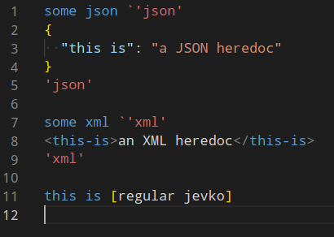

## Illustration



## Details

Extends the `Subjevko` rule from:

```abnf
Subjevko = Prefix Opener Jevko Closer
```

to:

```abnf
Subjevko = Prefix Opener Jevko Closer / Prefix Escaper Quoter HeredocTag Quoter Heredoc Quoter HeredocTag Quoter
```

where:

```abnf
Quoter = "'"
HeredocTag = *<any codepoint except Quoter>
Heredoc = *<any code point>
```

additionally:

* the second instance of `HeredocTag` must be identical to the first 
* and `Heredoc` must not contain the sequence:

```abnf
Quoter HeredocTag Quoter
```

where `HeredocTag` is also identical to the first `HeredocTag` instance.

## Examples of valid heredocs

Empty `Heredoc` with empty `HeredocTag`:

```
some prefix `''''
```

***

Empty `Heredoc` with `HeredocTag` = `some tag`

```
some prefix `'some tag''some tag'
```

***

Nonempty `Heredoc` with empty `HeredocTag`:

```
some prefix `''heredoc contents which contain []`]''
```

in this case `Heredoc` = `` heredoc contents which contain []`] ``.

## Examples of invalid heredocs

What looks like empty Heredoc with `HeredocTag` = `some tag`, but the second instance of `HeredocTag` (`some other tag`) does not match the first:

```
some prefix `'some tag''some other tag'
```

in this case `'some other tag'` would actually be considered part of the `Heredoc` and the second instance would be considered missing.

***

What looks like empty Heredoc with `HeredocTag` = `some tag`, but the `Heredoc` contains the forbidden sequence `'some tag'`:

```
some prefix `'some tag'content which contains 'some tag' and continues until here'some tag'
```

in this case `Heredoc` = `content which contains ` rather than `content which contains 'some tag' and continues until here`. The remainder of the example (` and continues until here'some tag'`) is actually a Suffix of the parent Jevko. 

Alternatively, if this example was to continue further like this:

```
some prefix `'some tag'content which contains 'some tag' and continues until here'some tag'
another prefix [something else]
```

then the remainder is actually part of the Prefix of the next Subjevko, making the Prefix:

```
 and continues until here'some tag'
another prefix 
```

rather than `another prefix `.